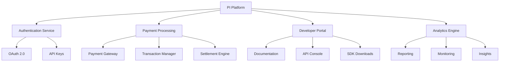
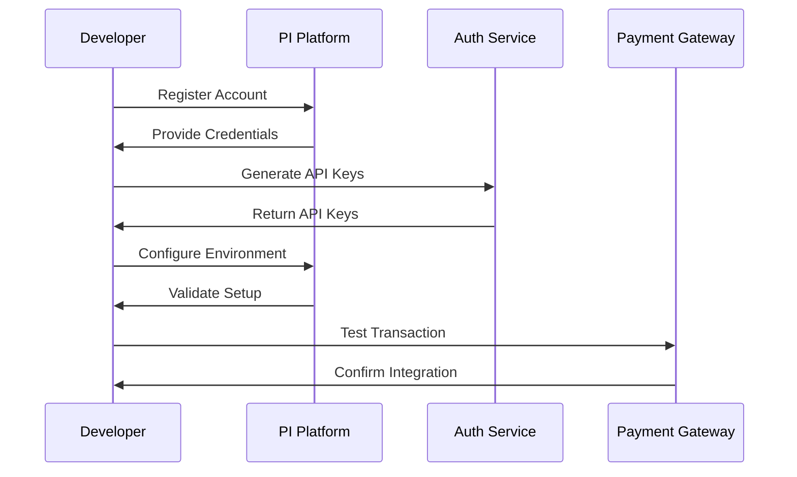
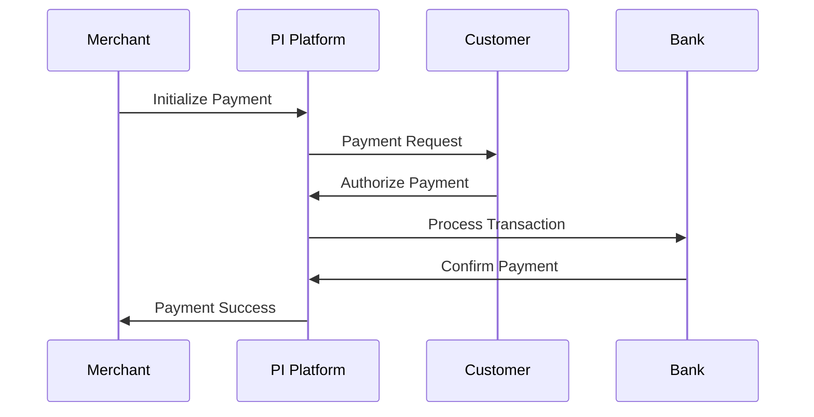
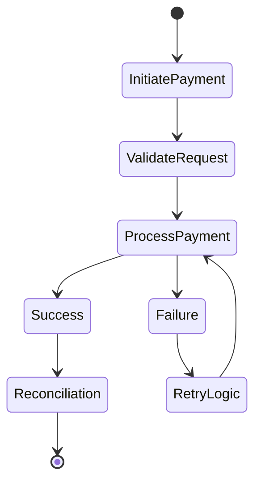
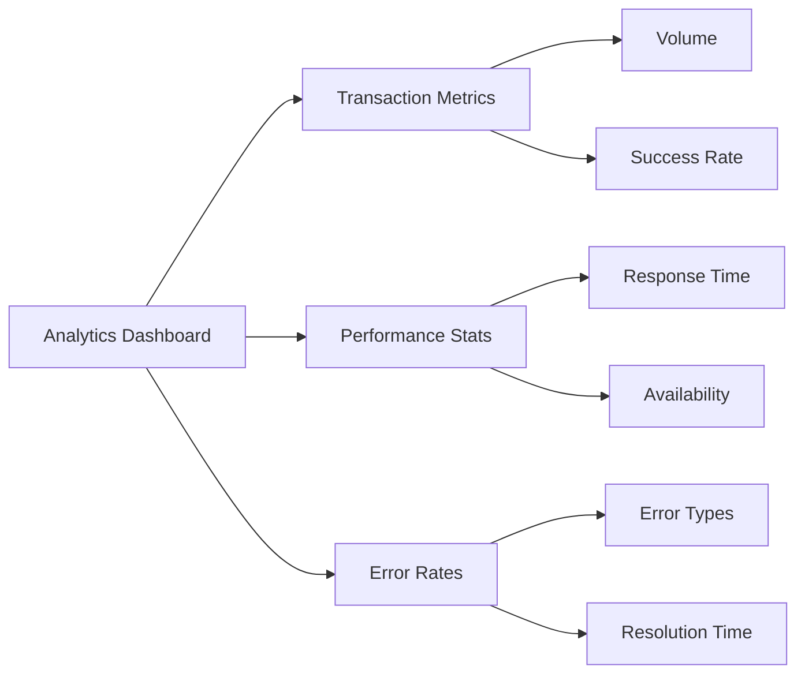

# 🚀 Complete PI Platform Guide

## 📚 Table of Contents
1. [Platform Overview](#platform-overview)
2. [Getting Started](#getting-started)
3. [Core Components](#core-components)
4. [Integration Workflows](#integration-workflows)
5. [Advanced Features](#advanced-features)
6. [Security & Best Practices](#security--best-practices)
7. [Troubleshooting](#troubleshooting)
8. [API Reference](#api-reference)

## 🌟 Platform Overview

### System Architecture



### Key Features
- 🔐 Secure Authentication
- 💳 Payment Processing
- 📊 Real-time Analytics
- 🛠️ Developer Tools
- 📱 Mobile Integration
- 🔄 Automated Settlements

## 🚦 Getting Started

### Prerequisites
1. Developer Account Setup
2. API Key Generation
3. Environment Configuration
4. SDK Installation

### Quick Start Flow



## 🔧 Core Components

### Authentication Service
- OAuth 2.0 Implementation
- Token Management
- Access Control
- Security Protocols

### Payment Processing
- Transaction Flow
- Payment Methods
- Settlement Process
- Reconciliation

### Developer Portal
- API Documentation
- Testing Tools
- Integration Guides
- Support Resources

## 🔄 Integration Workflows

### Basic Payment Integration



### Advanced Integration Scenarios



## 🛡️ Security & Best Practices

### Security Measures
1. Data Encryption
2. Secure Communication
3. Access Control
4. Audit Logging

### Best Practices
- API Usage Guidelines
- Error Handling
- Rate Limiting
- Data Validation

## 🔍 Monitoring & Analytics

### Dashboard Overview



## 📘 API Reference

### Endpoints Structure

```mermaid
graph TD
    A[API Root] --> B[/auth]
    A --> C[/payments]
    A --> D[/transactions]
    
    B --> B1[/login]
    B --> B2[/token]
    
    C --> C1[/create]
    C --> C2[/status]
    C --> C3[/refund]
    
    D --> D1[/list]
    D --> D2[/details]
    D --> D3[/reconcile]
```

## 🎯 Implementation Checklist

### Setup Phase
- [ ] Developer Account Creation
- [ ] API Key Generation
- [ ] Environment Configuration
- [ ] SDK Installation

### Integration Phase
- [ ] Basic Authentication
- [ ] Payment Processing
- [ ] Error Handling
- [ ] Testing & Validation

### Production Phase
- [ ] Security Audit
- [ ] Performance Testing
- [ ] Documentation Review
- [ ] Go-Live Preparation

## 📊 Status Tracking

### Development Progress
- 🟢 Core API (Completed)
- 🟡 Documentation (In Progress)
- 🟡 SDK Development (In Progress)
- 🔴 Advanced Features (Not Started)

### Integration Status
- ✅ Basic Authentication
- ✅ Payment Processing
- 🔄 Advanced Features
- ⏳ Testing & Validation 