# 🔧 PI Platform Technical Implementation Guide

## 📋 System Architecture Details

### Component Architecture

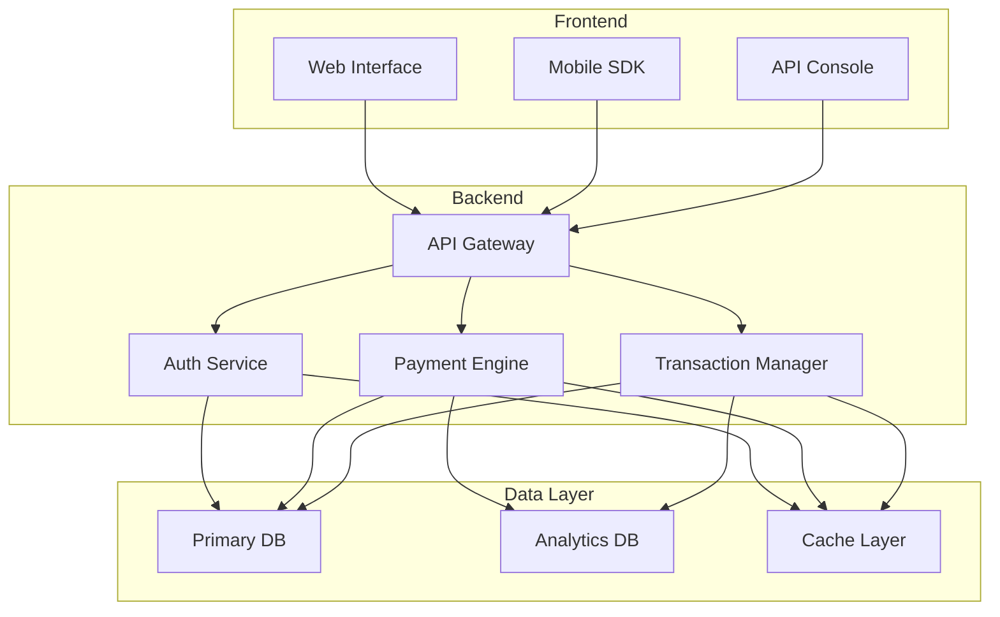

## 🛠️ Technical Specifications

### System Requirements
- Node.js v14+
- PostgreSQL 13+
- Redis 6+
- Docker 20+
- Kubernetes 1.20+

### Performance Metrics
- API Response Time: < 200ms
- Transaction Processing: < 2s
- Concurrent Users: 10,000+
- Transaction Rate: 1000 TPS

## 🔄 Development Workflow

### Setup Process

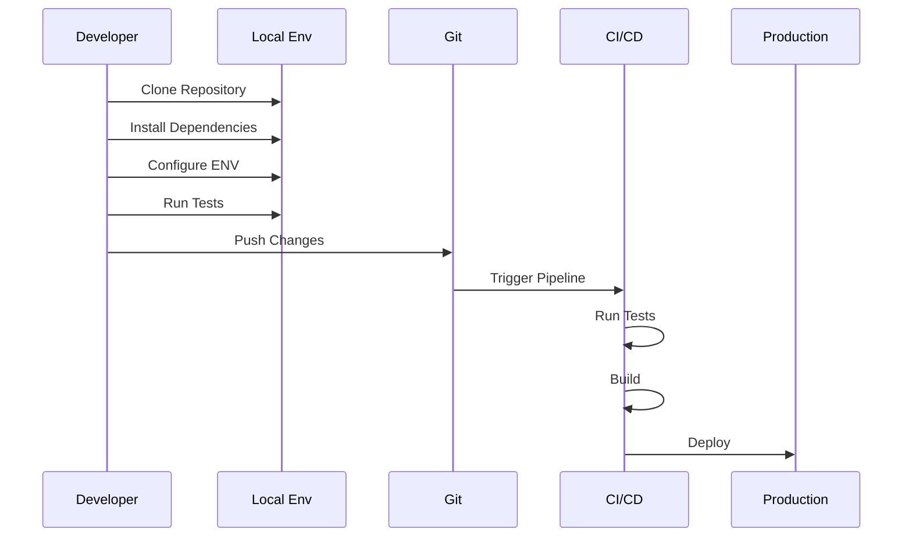

### Database Schema

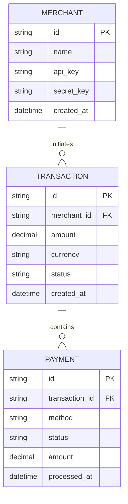

## 🔐 Security Implementation

### Authentication Flow

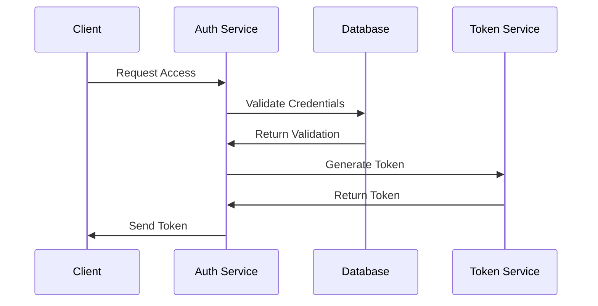

### Encryption Layers

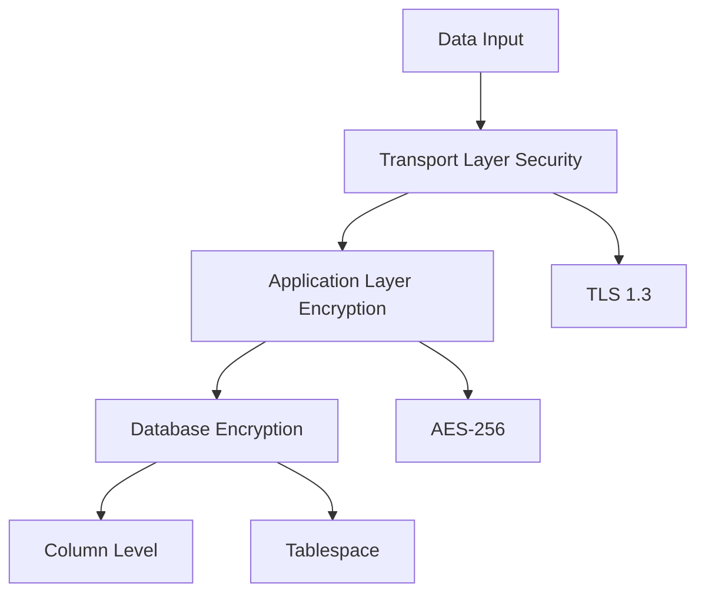

## 📊 Monitoring Setup

### Metrics Collection

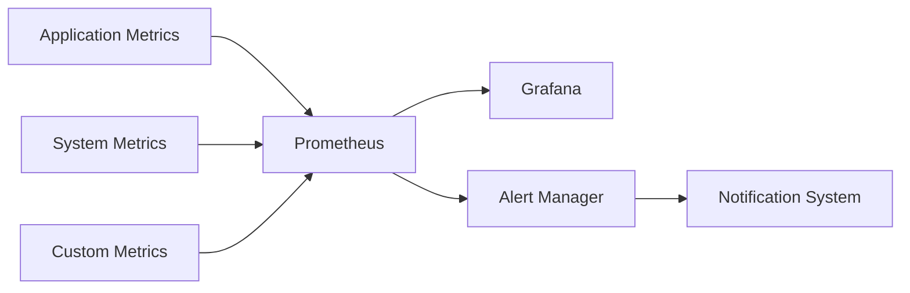

## 🚀 Deployment Architecture

### Infrastructure Setup

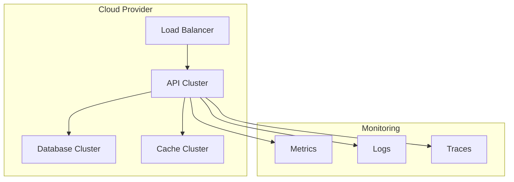

## 🔍 Testing Strategy

### Test Pyramid

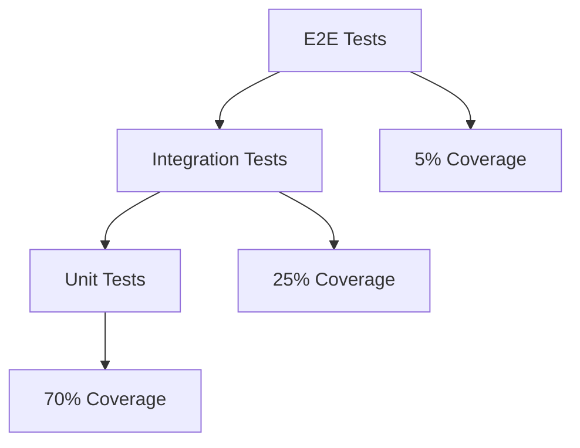

### Test Workflow

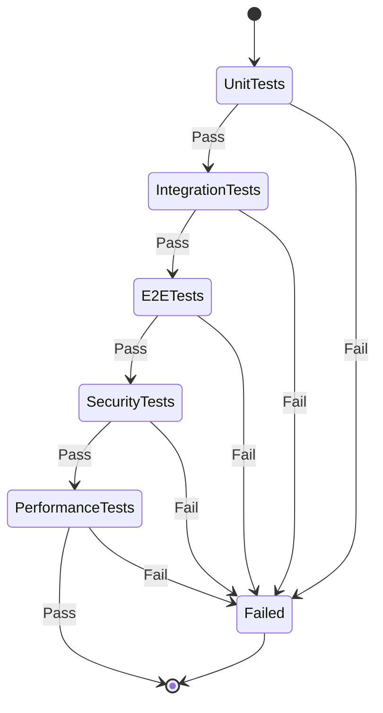

## 📈 Performance Optimization

### Caching Strategy

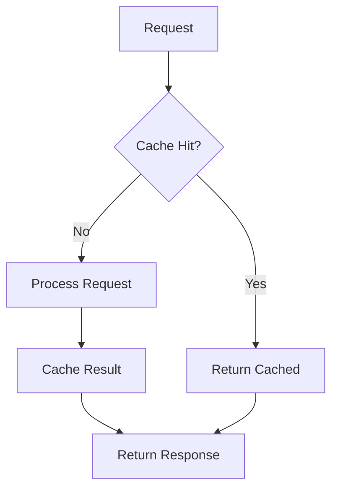

### Load Balancing

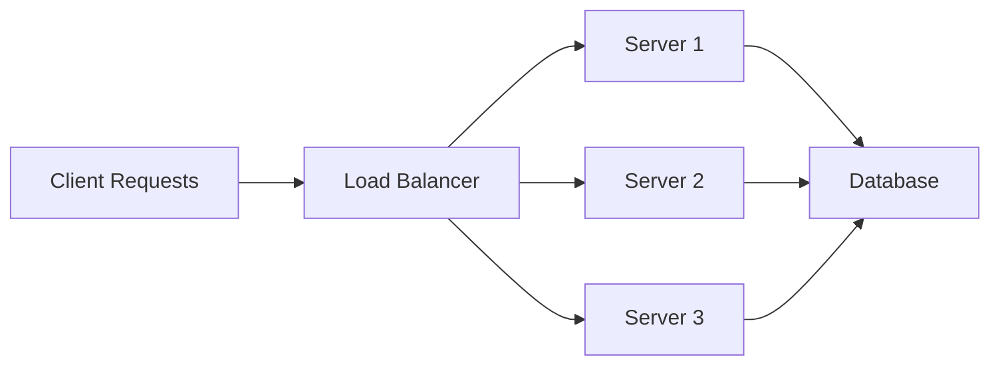

## 🎯 Implementation Checklist

### Development Phase
- [ ] Environment Setup
  - [ ] Docker Configuration
  - [ ] Database Setup
  - [ ] Cache Layer
  - [ ] API Gateway
- [ ] Core Services
  - [ ] Authentication
  - [ ] Payment Processing
  - [ ] Transaction Management
- [ ] Testing
  - [ ] Unit Tests
  - [ ] Integration Tests
  - [ ] Performance Tests

### Deployment Phase
- [ ] Infrastructure Setup
  - [ ] Kubernetes Cluster
  - [ ] Database Cluster
  - [ ] Monitoring Stack
- [ ] Security Implementation
  - [ ] SSL/TLS
  - [ ] API Security
  - [ ] Data Encryption
- [ ] Documentation
  - [ ] API Documentation
  - [ ] Integration Guide
  - [ ] Deployment Guide

## 📝 Development Notes

### Current Status
- 🟢 Core API Development
- 🟡 Integration Testing
- 🟡 Performance Optimization
- 🔴 Security Audit

### Known Issues
1. Rate Limiting Implementation
2. Cache Invalidation Strategy
3. Error Handling Standardization
4. API Version Management

### Next Steps
1. Complete Security Implementation
2. Optimize Database Queries
3. Implement Monitoring
4. Finalize Documentation 