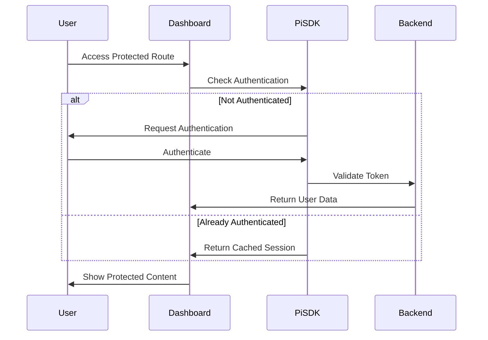
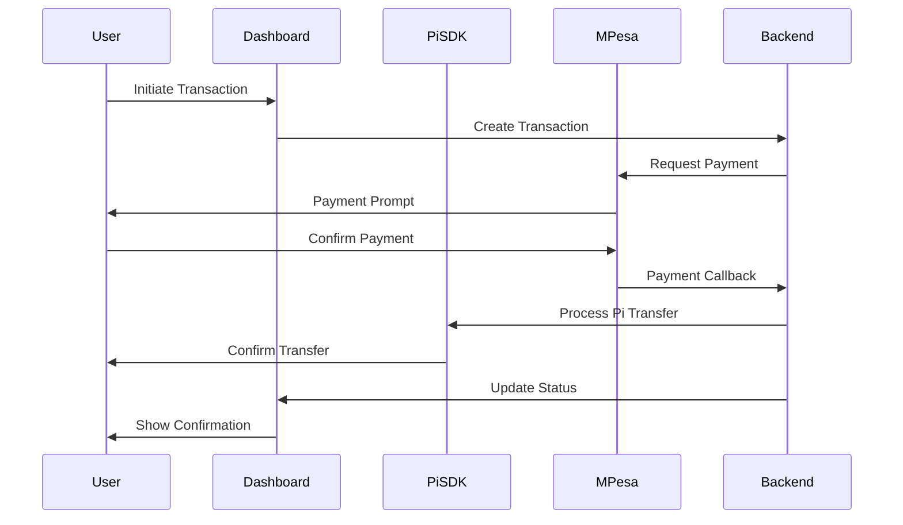
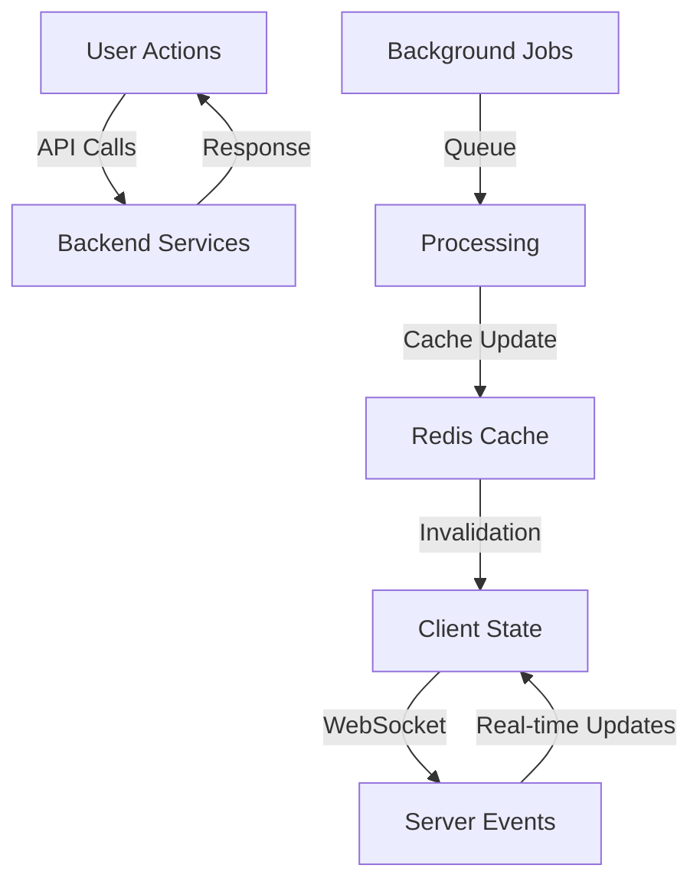
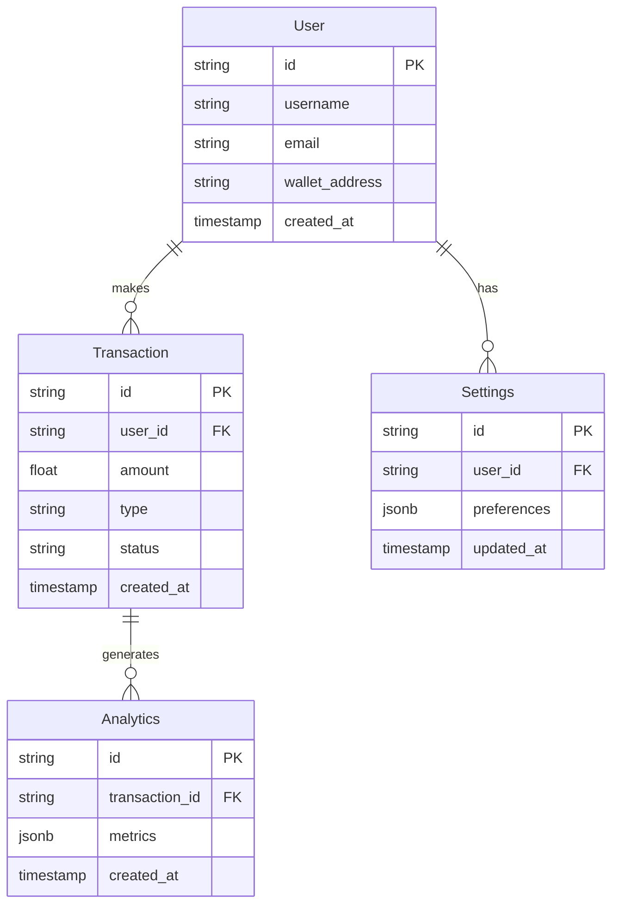
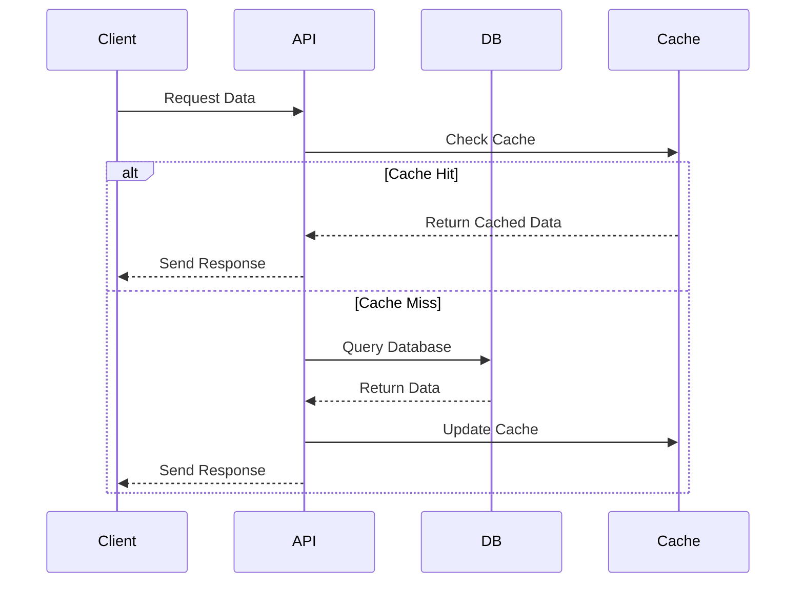

# Dashboard Development Guide - Piverse 🌟

## Overview 🎯
The Piverse dashboard serves as a comprehensive platform for managing Pi-to-M-Pesa exchanges, user interactions, and system analytics. It provides real-time monitoring, transaction management, and detailed insights into platform performance.

## Core Features & Implementation Status

### 1. Dashboard Overview 📊
#### Key Metrics Display
- ✅ Transaction Volume
- ✅ Active Users
- ✅ Exchange Rates
- ✅ System Status
- 🟡 Performance Metrics

#### Quick Actions
- ✅ Initiate Transaction
- ✅ View Recent Orders
- ✅ Check Notifications
- 🟡 Export Reports

### 2. Transaction Management 💰
#### Transaction Interface
```typescript
interface Transaction {
  id: string;
  type: 'buy' | 'sell';
  status: 'pending' | 'processing' | 'completed' | 'failed';
  amount: {
    pi: number;
    ksh: number;
  };
  user: {
    id: string;
    name: string;
    phone: string;
    email: string;
  };
  mpesa: {
    transactionId?: string;
    status: 'pending' | 'completed' | 'failed';
    confirmation?: string;
  };
  timestamp: Date;
  lastUpdated: Date;
}
```

#### Transaction Workflow 🔄
1. Transaction Initiation
   - User input validation
   - Rate calculation
   - Fee computation
2. M-Pesa Integration
   - Payment processing
   - Status tracking
   - Confirmation handling
3. Transaction Completion
   - Status updates
   - Notifications
   - Receipt generation

### 3. Analytics & Reporting 📈
#### Visualization Components
```typescript
// Volume Trends
<AreaChart
  data={volumeData}
  options={{
    gradient: true,
    tooltips: true,
    legend: true,
    responsive: true
  }}
/>

// Transaction Distribution
<PieChart
  data={transactionTypes}
  options={{
    colors: chartColors,
    labels: true,
    animation: true
  }}
/>

// User Activity
<LineChart
  data={userActivity}
  options={{
    multiSeries: true,
    annotations: true,
    zoom: true
  }}
/>
```

### 4. User Management 👥
#### Features
- ✅ User Profiles
  - Personal details
  - Transaction history
  - Security settings
- ✅ Access Control
  - Role management
  - Permission settings
  - Activity logs
- 🟡 User Analytics
  - Behavior tracking
  - Usage patterns
- Performance metrics

### 5. Notification System 🔔
#### Implementation
```typescript
interface Notification {
  id: string;
  title: string;
  message: string;
  type: 'info' | 'success' | 'warning' | 'error';
  time: Date;
  read: boolean;
  action?: {
    label: string;
    url: string;
  };
}
```

#### Features
- Real-time notifications
- Status updates
- System alerts
- Action required notices

## Technical Implementation

### 1. Component Architecture 🏗️
```typescript
// Dashboard Layout
<DashboardLayout>
  <Sidebar 
    items={navItems}
    isCollapsed={isCollapsed}
    onToggle={toggleSidebar}
  />
  <MainContent>
    <Header 
      user={currentUser}
      notifications={notifications}
    />
    <PageContent>
      {children}
    </PageContent>
  </MainContent>
</DashboardLayout>

// Reusable Components
<MetricCard
  title="Daily Volume"
  value={formatCurrency(volume)}
  trend={trend}
  icon={<TrendingUp />}
  loading={loading}
/>

<DataTable
  data={transactions}
  columns={columns}
  pagination={true}
  filters={true}
  sorting={true}
  selection={true}
/>
```

### 2. State Management 🔄
#### Global State
```typescript
interface DashboardState {
  user: User;
  settings: Settings;
  theme: Theme;
  notifications: Notification[];
}

// Context Provider
<DashboardProvider>
  <ThemeProvider>
    <NotificationProvider>
      <App />
    </NotificationProvider>
  </ThemeProvider>
</DashboardProvider>
```

### 3. API Integration 🔌
#### Service Structure
```typescript
class DashboardService {
  // Transaction APIs
  async getTransactions(filters: FilterParams): Promise<Transaction[]>;
  async processTransaction(data: TransactionInput): Promise<Transaction>;
  
  // Analytics APIs
  async getMetrics(timeframe: TimeFrame): Promise<Metrics>;
  async generateReport(params: ReportParams): Promise<Report>;
  
  // User Management
  async updateUserProfile(data: ProfileUpdate): Promise<User>;
  async managePermissions(data: PermissionUpdate): Promise<void>;
}
```

## Best Practices

### 1. Performance Optimization 🚀
- Implement lazy loading for routes and components
- Use virtualization for long lists
- Optimize API calls with caching
- Implement debouncing for search inputs

### 2. Error Handling 🛠️
- Global error boundary implementation
- Graceful degradation strategy
- Retry mechanism for failed requests
- User-friendly error messages

### 3. Security Measures 🔒
- Input sanitization
- CSRF protection
- Rate limiting
- Session management
- Audit logging

### 4. Accessibility ♿
- ARIA labels implementation
- Keyboard navigation support
- Screen reader compatibility
- Color contrast compliance

## Next Steps 🎯

### Short Term
1. Enhance real-time updates system
2. Implement advanced analytics dashboard
3. Add batch operation support
4. Optimize mobile responsiveness

### Long Term
1. Implement AI-powered insights
2. Add predictive analytics
3. Enhance security features
4. Scale notification system

## Development Guidelines

### 1. Code Organization
- Follow feature-based structure
- Maintain consistent naming conventions
- Document complex logic
- Write unit tests

### 2. Styling Standards
- Use Tailwind utility classes
- Maintain consistent spacing
- Follow responsive design principles
- Implement dark mode support

### 3. Performance Goals
- First load under 2 seconds
- API response under 200ms
- 60 FPS animations
- Optimal bundle size

### Version 1.2.0 (2024-02-28)
- ✅ Advanced analytics dashboard
  - Enhanced visualization components
  - Real-time data processing
  - Custom metric tracking
- ✅ Mobile optimization improvements
  - Responsive layout enhancements
  - Touch-optimized interactions
  - Performance optimizations
- ✅ Security updates
  - Advanced authentication flow
  - Enhanced error handling
  - Improved data validation

## 📋 Current Development Focus

### High Priority Tasks
1. Advanced filtering system
   - Custom filter builder
   - Saved filter presets
   - Bulk operations support

2. Real-time updates optimization
   - WebSocket connection stability
   - Data synchronization
   - Cache management

3. Mobile performance
   - Asset optimization
   - Progressive loading
   - Offline capabilities

4. Analytics expansion
   - Custom dashboards
   - Advanced reporting
   - Data export features

### Technical Debt
1. Test coverage
   - Unit test expansion
   - Integration tests
   - E2E test suite

2. Documentation
   - API documentation
   - Component library
   - Development guides

3. Performance
   - Bundle optimization
   - Code splitting
   - Cache strategies

## 📊 Success Metrics

### Performance Targets
- Page Load: < 2 seconds
- Time to Interactive: < 3 seconds
- First Paint: < 1 second
- Core Web Vitals: All green

### User Experience Goals
- Task Completion: > 95%
- Error Rate: < 1%
- User Satisfaction: > 90%
- Mobile Usage: > 40%

## 🔄 Deployment Schedule

### Sprint 1 (April 1-15, 2025)
- Advanced filtering system
- Real-time optimization
- Documentation updates

### Sprint 2 (April 16-30, 2025)
- Mobile performance
- Analytics expansion
- Test coverage

### Sprint 3 (May 1-15, 2025)
- Security enhancements
- Performance optimization
- Final polish

## 🛠️ Development Environment

### Required Tools
- Node.js v18+
- npm/yarn
- Git
- VS Code (recommended)

### Recommended Extensions
- ESLint
- Prettier
- TypeScript
- React Developer Tools

### Development Commands
```bash
# Install dependencies
npm install

# Start development server
npm run dev

# Run tests
npm test

# Build for production
npm run build
```

## 📊 Monitoring & Analytics

### Performance Metrics
- Page load times
- API response times
- Error rates
- User interactions

### User Analytics
- Session duration
- Feature usage
- Navigation paths
- Conversion rates

### System Health
- Service uptime
- Resource utilization
- Cache performance
- Database metrics

## 🔄 Continuous Integration

### Build Pipeline
- Code linting
- Type checking
- Unit testing
- Integration testing

### Deployment Process
- Staging environment
- Production release
- Rollback procedures
- Health checks

### Quality Assurance
- Automated testing
- Manual testing
- Performance testing
- Security scanning

## 📱 Mobile Optimization

### Responsive Design
- Fluid layouts
- Touch interactions
- Gesture support
- Offline capabilities

### Performance
- Asset optimization
- Code splitting
- Cache strategies
- Progressive loading

### User Experience
- Navigation patterns
- Form handling
- Error states
- Loading indicators

## 🎯 Future Enhancements

### Q2 2024
- Advanced analytics
- Custom reporting
- Mobile optimization
- Performance improvements

### Q3 2024
- AI-powered insights
- Automated workflows
- Enhanced security
- Scale optimization

### Q4 2024
- Global deployment
- Enterprise features
- Advanced integrations
- Full mobile release

## 📊 System Workflows

### Authentication Flow


### Transaction Flow


### Data Synchronization


## 📅 Updated Timeline (2025)

### Q1 (January - March)
- Core infrastructure setup
- Basic transaction processing
- User authentication
- Dashboard layout

### Q2 (April - June)
- Advanced analytics
- Real-time monitoring
- Mobile optimization
- Performance improvements

### Q3 (July - September)
- AI integration
- Advanced reporting
- Custom dashboards
- Security enhancements

### Q4 (October - December)
- Global deployment
- Enterprise features
- Advanced integrations
- Platform scaling

## Database Schema & Architecture 🗄️

### Entity Relationship Diagram


### Data Models

#### 1. User Model
```typescript
interface User {
  id: string;              // Primary key
  username: string;        // Pi Network username
  email: string;          // User email
  wallet_address: string; // Pi wallet address
  created_at: Date;       // Account creation date
  settings?: Settings;    // Related settings
  transactions?: Transaction[]; // Related transactions
}
```

#### 2. Transaction Model
```typescript
interface Transaction {
  id: string;           // Primary key
  user_id: string;      // Foreign key to User
  amount: number;       // Transaction amount
  type: 'buy' | 'sell'; // Transaction type
  status: 'pending' | 'completed' | 'failed'; // Transaction status
  created_at: Date;     // Transaction date
  analytics?: Analytics[]; // Related analytics
}
```

#### 3. Analytics Model
```typescript
interface Analytics {
  id: string;           // Primary key
  transaction_id: string; // Foreign key to Transaction
  metrics: {            // JSON metrics data
    processing_time: number;
    fee: number;
    exchange_rate: number;
    network_status: string;
  };
  created_at: Date;     // Analytics creation date
}
```

#### 4. Settings Model
```typescript
interface Settings {
  id: string;           // Primary key
  user_id: string;      // Foreign key to User
  preferences: {        // JSON preferences data
    notifications: boolean;
    theme: 'light' | 'dark';
    language: string;
    currency: string;
  };
  updated_at: Date;     // Last update date
}
```

### Database Operations Flow



### Data Access Patterns

1. **User Operations**
   ```sql
   -- Create User
   INSERT INTO users (id, username, email, wallet_address)
   VALUES ($1, $2, $3, $4);

   -- Get User with Settings
   SELECT u.*, s.*
   FROM users u
   LEFT JOIN settings s ON u.id = s.user_id
   WHERE u.id = $1;
   ```

2. **Transaction Operations**
   ```sql
   -- Create Transaction
   INSERT INTO transactions (id, user_id, amount, type, status)
   VALUES ($1, $2, $3, $4, $5);

   -- Get User Transactions
   SELECT t.*, a.*
   FROM transactions t
   LEFT JOIN analytics a ON t.id = a.transaction_id
   WHERE t.user_id = $1
   ORDER BY t.created_at DESC;
   ```

3. **Analytics Operations**
   ```sql
   -- Create Analytics Entry
   INSERT INTO analytics (id, transaction_id, metrics)
   VALUES ($1, $2, $3);

   -- Get Transaction Analytics
   SELECT *
   FROM analytics
   WHERE transaction_id = $1;
   ```

### Performance Optimization

1. **Indexes**
   ```sql
   -- User Indexes
   CREATE INDEX idx_users_username ON users(username);
   CREATE INDEX idx_users_wallet ON users(wallet_address);

   -- Transaction Indexes
   CREATE INDEX idx_transactions_user ON transactions(user_id);
   CREATE INDEX idx_transactions_status ON transactions(status);
   CREATE INDEX idx_transactions_date ON transactions(created_at);
   ```

2. **Caching Strategy**
   ```typescript
   // Cache Configuration
   const cacheConfig = {
     user: { ttl: 3600 },        // 1 hour
     transaction: { ttl: 1800 },  // 30 minutes
     analytics: { ttl: 7200 }     // 2 hours
   };
   ```