# Pi Platform Integration Guide 🚀

## Table of Contents
- [Overview](#overview)
- [Prerequisites](#prerequisites)
- [Authentication Flow](#authentication-flow)
- [Payment Integration](#payment-integration)
- [Implementation Steps](#implementation-steps)
- [Testing & Sandbox](#testing--sandbox)
- [Troubleshooting](#troubleshooting)

## Overview 📋
This guide details the integration of Pi Platform SDK for user authentication and payment processing in our Pi-MPESA Exchange application. The integration enables secure user authentication and handles Pi coin transactions within the Pi Browser environment.

## System Workflows 🔄

### 1. Overall System Architecture 🏗️

```mermaid
graph TD
    A[🌐 Pi Browser] --> B[📱 Pi-MPESA Exchange App]
    B --> C[🔐 Pi SDK]
    B --> D[💳 MPESA API]
    
    subgraph Backend Services
        E[🖥️ App Server]
        F[📊 Database]
        G[📡 WebSocket Server]
    end
    
    B --> E
    E --> F
    E --> G
    G --> B
    
    subgraph External Services
        H[⛓️ Pi Blockchain]
        I[💰 MPESA Network]
    end
    
    C --> H
    D --> I
```


### 2. Authentication Flow 🔑

```mermaid
sequenceDiagram
    participant U as 👤 User
    participant A as 📱 App
    participant S as 🖥️ SDK
    participant B as ⚡ Backend
    participant P as 🌐 Pi Platform

    U->>A: Open App
    A->>S: Initialize SDK
    A->>S: Request Auth
    S->>U: Request Permissions
    U->>S: Grant Permissions
    S->>P: Validate User
    P->>S: Return Auth Token
    S->>A: Auth Success
    A->>B: Verify Token
    B->>P: Validate Token
    P->>B: User Details
    B->>A: Auth Confirmed
```


### 3. Buy Pi Workflow 💎

```mermaid
sequenceDiagram
    participant U as 👤 User
    participant A as 📱 App
    participant M as 💳 MPESA
    participant B as 🖥️ Backend
    participant P as ⛓️ Pi Platform

    U->>A: Initiate Buy
    A->>B: Check Exchange Rate
    B->>A: Current Rate
    U->>A: Confirm Amount
    A->>M: Request MPESA Payment
    M->>U: Payment Prompt
    U->>M: Confirm Payment
    M->>B: Payment Notification
    B->>P: Create Pi Payment
    P->>B: Payment Created
    B->>A: Update Status
    A->>U: Show Success
```


### 4. Sell Pi Workflow 💰

```mermaid
sequenceDiagram
    participant U as 👤 User
    participant A as 📱 App
    participant P as ⛓️ Pi Platform
    participant B as 🖥️ Backend
    participant M as 💳 MPESA

    U->>A: Initiate Sell
    A->>B: Verify MPESA Account
    B->>A: Account Valid
    U->>A: Confirm Amount
    A->>P: Create Payment
    P->>U: Sign Transaction
    U->>P: Confirm Transaction
    P->>B: Transaction Complete
    B->>M: Initiate MPESA Transfer
    M->>U: Receive Payment
    B->>A: Update Status
    A->>U: Show Success
```


### 5. Dashboard Data Flow 📊

```mermaid
graph TD
    A[📱 User Actions] --> B[🔄 Real-time Events]
    B --> C[📡 WebSocket Server]
    C --> D[📊 Dashboard Updates]
    
    subgraph Data Processing
        E[📈 Transaction Analytics]
        F[💹 Exchange Rates]
        G[📜 History Logs]
    end
    
    C --> E
    C --> F
    C --> G
    
    E --> D
    F --> D
    G --> D
    
    D --> H[👁️ User View]
```


### 6. Error Handling Flow ⚠️

```mermaid
graph TD
    A[❌ Error Detected] --> B{🔍 Error Type}
    
    B -->|Auth Error| C[🔐 Auth Handler]
    B -->|Payment Error| D[💰 Payment Handler]
    B -->|Network Error| E[🌐 Network Handler]
    B -->|MPESA Error| F[💳 MPESA Handler]
    
    C --> G[🔄 Retry Auth]
    D --> H[📝 Log Error]
    E --> I[⚡ Retry Request]
    F --> J[📞 Support Contact]
    
    G --> K[👤 User Notification]
    H --> K
    I --> K
    J --> K
```


## Transaction States 🔄

### Payment Status Workflow


## Prerequisites 🔧
- Pi Browser environment
- Access to Pi Developer Portal
- Pi SDK integration
- Backend server setup for API endpoints

## Authentication Flow 🔐

### 1. SDK Initialization and Setup 🛠️
```typescript
// In your app's entry point (e.g., index.html or App.tsx)
<script src="https://sdk.minepi.com/pi-sdk.js"></script>
<script>
  // Initialize in sandbox mode for development
  Pi.init({ 
    version: "2.0", 
    sandbox: process.env.NODE_ENV !== 'production' 
  });
</script>

// Configuration types
interface PiConfig {
  apiKey: string;
  sandboxMode: boolean;
  apiEndpoint: string;
}

// config.ts
export const piConfig: PiConfig = {
  apiKey: process.env.PI_API_KEY,
  sandboxMode: process.env.NODE_ENV !== 'production',
  apiEndpoint: process.env.PI_API_ENDPOINT
};
```

### 2. User Authentication Implementation 👤
```typescript
const authenticateUser = async () => {
  try {
    // Request scopes: username for basic info, payments for transactions
    const scopes = ['username', 'payments', 'wallet_address'];
    
    // Handle incomplete payments if found
    const onIncompletePaymentFound = (payment) => {
      // Implement incomplete payment handling
      console.log('Incomplete payment found:', payment);
    };

    // Authenticate user
    const authResult = await window.Pi.authenticate(scopes, onIncompletePaymentFound);
    
    // authResult contains:
    // - accessToken: for API calls
    // - user: { uid, username }
    return authResult;
  } catch (error) {
    console.error('Authentication failed:', error);
    throw error;
  }
};
```

### 3. Server Verification 🔍
```typescript
// Verify authentication on backend
const verifyAuth = async (accessToken: string) => {
  const response = await axios.get('https://api.minepi.com/v2/me', {
    headers: { 'Authorization': `Bearer ${accessToken}` }
  });
  return response.data; // Returns UserDTO
};
```

## Transaction Workflows 💱

### 1. Buy Pi with MPESA Flow 📥
```typescript
// types/transactions.ts
interface BuyPiRequest {
  amount: number;
  mpesaPhone: string;
  exchangeRate: number;
  mpesaAmount: number;
}

// components/BuyPi.tsx
const BuyPiComponent: React.FC = () => {
  const [buyRequest, setBuyRequest] = useState<BuyPiRequest>();
  
  const initiateBuyOrder = async (request: BuyPiRequest) => {
    try {
      // 1. Create payment order
      const paymentData = {
        amount: request.amount,
        memo: `Buy ${request.amount} Pi with ${request.mpesaAmount} KES`,
        metadata: {
          type: 'buy_pi',
          mpesaPhone: request.mpesaPhone,
          exchangeRate: request.exchangeRate,
          mpesaAmount: request.mpesaAmount,
          timestamp: Date.now()
        }
      };

      // 2. Setup callbacks
      const callbacks = {
        onReadyForServerApproval: async (paymentId: string) => {
          await axios.post('/api/transactions/buy/approve', {
            paymentId,
            buyRequest: request
          });
        },
        onReadyForServerCompletion: async (paymentId: string, txid: string) => {
          await axios.post('/api/transactions/buy/complete', {
            paymentId,
            txid,
            buyRequest: request
          });
        },
        onCancel: (paymentId: string) => {
          notifyUser('Transaction cancelled');
          logTransactionEvent({
            type: 'buy_cancelled',
            paymentId
          });
        },
        onError: (error: Error, payment?: PaymentDTO) => {
          handleTransactionError(error, payment);
        }
      };

      await Pi.createPayment(paymentData, callbacks);
    } catch (error) {
      handleError(error);
    }
  };

  return (
    <BuyPiForm onSubmit={initiateBuyOrder} />
  );
};
```

### 2. Sell Pi for MPESA Flow 📤
```typescript
// types/transactions.ts
interface SellPiRequest {
  piAmount: number;
  mpesaPhone: string;
  exchangeRate: number;
  expectedMpesaAmount: number;
}

// components/SellPi.tsx
const SellPiComponent: React.FC = () => {
  const [sellRequest, setSellRequest] = useState<SellPiRequest>();
  
  const initiateSellOrder = async (request: SellPiRequest) => {
    try {
      // 1. Verify MPESA details first
      await verifyMpesaAccount(request.mpesaPhone);

      // 2. Create sell order
      const paymentData = {
        amount: request.piAmount,
        memo: `Sell ${request.piAmount} Pi for ${request.expectedMpesaAmount} KES`,
        metadata: {
          type: 'sell_pi',
          mpesaPhone: request.mpesaPhone,
          exchangeRate: request.exchangeRate,
          expectedMpesaAmount: request.expectedMpesaAmount,
          timestamp: Date.now()
        }
      };

      const callbacks = {
        onReadyForServerApproval: async (paymentId: string) => {
          await axios.post('/api/transactions/sell/approve', {
            paymentId,
            sellRequest: request
          });
        },
        onReadyForServerCompletion: async (paymentId: string, txid: string) => {
          // Initiate MPESA payment after Pi transfer confirmation
          await axios.post('/api/transactions/sell/complete', {
            paymentId,
            txid,
            sellRequest: request
          });
        }
      };

      await Pi.createPayment(paymentData, callbacks);
    } catch (error) {
      handleError(error);
    }
  };

  return (
    <SellPiForm onSubmit={initiateSellOrder} />
  );
};
```

### 3. Dashboard Integration & Historical Data 📊

```typescript
// types/dashboard.ts
interface TransactionHistory {
  id: string;
  type: 'buy' | 'sell';
  status: 'pending' | 'completed' | 'failed';
  piAmount: number;
  mpesaAmount: number;
  exchangeRate: number;
  timestamp: Date;
  paymentId?: string;
  txid?: string;
  mpesaPhone: string;
}

// components/Dashboard/TransactionHistory.tsx
const TransactionHistory: React.FC = () => {
  const [transactions, setTransactions] = useState<TransactionHistory[]>([]);
  
  useEffect(() => {
    // Load transaction history
    const loadHistory = async () => {
      const response = await axios.get('/api/transactions/history');
      setTransactions(response.data);
    };
    
    loadHistory();
  }, []);

  return (
    <div className="transaction-history">
      <h2>Transaction History</h2>
      <TransactionTable transactions={transactions} />
      <TransactionStats transactions={transactions} />
      <TransactionCharts transactions={transactions} />
    </div>
  );
};

// Backend: Transaction Storage
interface TransactionRecord extends TransactionHistory {
  piPaymentDTO?: PaymentDTO;
  mpesaConfirmation?: MpesaConfirmation;
}

// services/TransactionService.ts
class TransactionService {
  async createTransaction(type: 'buy' | 'sell', data: any): Promise<TransactionRecord> {
    // 1. Create transaction record
    const transaction = await this.db.transactions.create({
      type,
      status: 'pending',
      ...data
    });

    // 2. Store in database
    await this.db.save(transaction);

    // 3. Emit event for real-time updates
    this.eventEmitter.emit('transaction:created', transaction);

    return transaction;
  }

  async updateTransactionStatus(
    id: string,
    status: 'completed' | 'failed',
    data: any
  ): Promise<TransactionRecord> {
    // 1. Update transaction
    const transaction = await this.db.transactions.findById(id);
    transaction.status = status;
    transaction.piPaymentDTO = data.piPaymentDTO;
    transaction.mpesaConfirmation = data.mpesaConfirmation;

    // 2. Save updates
    await this.db.save(transaction);

    // 3. Emit update event
    this.eventEmitter.emit('transaction:updated', transaction);

    return transaction;
  }

  async getTransactionHistory(
    filters: TransactionFilters
  ): Promise<TransactionRecord[]> {
    return this.db.transactions.find({
      where: filters,
      order: { timestamp: 'DESC' }
    });
  }
}
```

### 4. Real-time Dashboard Updates 🔄

```typescript
// components/Dashboard/LiveUpdates.tsx
const LiveDashboard: React.FC = () => {
  const socket = useSocket();
  const [stats, setStats] = useState<DashboardStats>();

  useEffect(() => {
    // Listen for real-time updates
    socket.on('transaction:created', handleNewTransaction);
    socket.on('transaction:updated', handleTransactionUpdate);
    socket.on('exchange:rate:updated', handleExchangeRateUpdate);

    return () => {
      socket.off('transaction:created');
      socket.off('transaction:updated');
      socket.off('exchange:rate:updated');
    };
  }, []);

  return (
    <div className="live-dashboard">
      <ExchangeRateDisplay stats={stats} />
      <RecentTransactions />
      <TradingVolume stats={stats} />
    </div>
  );
};
```

## Payment Integration 💰

### 1. What are Pi Payments? 🤔
Pi Payments are wrappers around blockchain transactions that synchronize three key components:
- Your app
- The Pi blockchain
- The Pi Servers

These wrappers abstract the blockchain complexity while ensuring transaction validity and security.

### 2. Payment Flow Phases 📊

#### Phase I: Payment Creation and Server-Side Approval 🎯
1. **Frontend Payment Creation**
   - App creates payment via SDK
   - Payment UI opens (non-interactive until server approval)
   - Pioneer sees payment details

2. **Server Approval Process**
   ```typescript
   // Frontend: Create Payment
   const initiatePayment = async (amount: number) => {
     const paymentData = {
       amount,
       memo: "Pi-MPESA Exchange Transaction",
       metadata: { 
         orderId: generateOrderId(),
         timestamp: Date.now(),
         type: 'pi_to_mpesa'
       }
     };

     const callbacks = {
       onReadyForServerApproval: async (paymentId) => {
         try {
           // Send to backend for approval
           await axios.post('/api/payments/approve', { paymentId });
         } catch (error) {
           console.error('Server approval failed:', error);
         }
       },
       // ... other callbacks
     };

     return Pi.createPayment(paymentData, callbacks);
   };

   // Backend: Approve Payment
   app.post('/api/payments/approve', async (req, res) => {
     try {
       const { paymentId } = req.body;
       const response = await axios.post(
         `https://api.minepi.com/v2/payments/${paymentId}/approve`,
         {},
         { headers: { 'Authorization': `Key ${PI_API_KEY}` } }
       );
       res.json(response.data);
     } catch (error) {
       res.status(500).json({ error: 'Payment approval failed' });
     }
   });
   ```

#### Phase II: Pioneer Interaction & Blockchain Transaction 🔄
During this phase:
1. Payment dialog becomes interactive
2. Pioneer can:
   - Review transaction details
   - Sign the transaction
   - Submit to Pi blockchain
3. Pi Platform handles all blockchain interactions
4. Transaction completion is managed by Pi Wallet

```typescript
// No direct code needed - handled by Pi Platform
// But implement UI feedback:
const PaymentStatus = () => {
  return (
    <div className="payment-status">
      <LoadingSpinner />
      <h3>Transaction In Progress</h3>
      <p>Please confirm the transaction in your Pi Wallet</p>
    </div>
  );
};
```

#### Phase III: Server-Side Completion ✅
1. **Transaction Verification**
   ```typescript
   // Frontend: Handle completion
   const callbacks = {
     onReadyForServerCompletion: async (paymentId, txid) => {
       try {
         await axios.post('/api/payments/complete', { 
           paymentId,
           txid,
           timestamp: Date.now()
         });
         // Update UI with success
         showSuccessMessage();
       } catch (error) {
         console.error('Completion failed:', error);
         showErrorMessage();
       }
     }
   };

   // Backend: Complete Payment
   app.post('/api/payments/complete', async (req, res) => {
     try {
       const { paymentId, txid } = req.body;
       
       // 1. Verify with Pi Platform
       const completion = await axios.post(
         `https://api.minepi.com/v2/payments/${paymentId}/complete`,
         { txid },
         { headers: { 'Authorization': `Key ${PI_API_KEY}` } }
       );

       // 2. Verify payment details match expected
       const paymentDTO = completion.data;
       if (!verifyPaymentDetails(paymentDTO)) {
         throw new Error('Payment verification failed');
       }

       // 3. Update local database
       await updateTransactionStatus(paymentId, 'completed');
       
       res.json({ success: true });
     } catch (error) {
       res.status(500).json({ error: 'Payment completion failed' });
     }
   });
   ```

### 3. Security Considerations 🔒

#### Critical Security Rules
1. **Never Trust Client-Side Data**
   ```typescript
   // ❌ WRONG - Trusting client data
   app.post('/complete-payment', (req, res) => {
     markPaymentComplete(req.body.paymentId);
   });

   // ✅ CORRECT - Verify with Pi Platform
   app.post('/complete-payment', async (req, res) => {
     const piResponse = await verifyWithPiPlatform(req.body.paymentId);
     if (piResponse.status === 200) {
       markPaymentComplete(req.body.paymentId);
     }
   });
   ```

2. **Verify All Transactions Server-Side**
   - Always call Pi Platform API endpoints
   - Verify transaction details match expected values
   - Check payment amounts and metadata

3. **Handle Incomplete Payments**
   ```typescript
   const handleIncompletePayment = async (payment: PaymentDTO) => {
     // 1. Log incomplete payment
     await logIncompletePayment(payment);

     // 2. Verify payment status
     const status = await checkPaymentStatus(payment.identifier);

     // 3. Take appropriate action
     if (status.transaction_verified && !status.developer_completed) {
       await completePayment(payment.identifier, payment.transaction.txid);
     } else {
       await cancelPayment(payment.identifier);
     }
   };
   ```

### 4. Testing Workflow 🧪

#### Sandbox Testing
```typescript
// Initialize SDK in sandbox mode
Pi.init({ 
  version: "2.0", 
  sandbox: true // Enable sandbox for testing
});

// Test cases to implement
const testCases = [
  'Create payment with valid amount',
  'Handle server approval timeout',
  'Handle user cancellation',
  'Verify transaction completion',
  'Test incomplete payment recovery'
];
```

#### Production Deployment Checklist
- [ ] Sandbox testing completed
- [ ] Error handling implemented
- [ ] Security measures verified
- [ ] Logging system in place
- [ ] Monitoring setup
- [ ] Backup procedures documented
- [ ] Rate limiting implemented
- [ ] API key security confirmed

## Testing & Sandbox 🧪

### Sandbox Mode
```javascript
// For development/testing
Pi.init({ version: "2.0", sandbox: true });
```

### Testing Workflow
1. 🔄 Test in Sandbox environment first
2. 🔍 Verify all callbacks are working
3. ✅ Test error scenarios
4. 🧪 Validate payment flows
5. 📝 Document any issues

## Troubleshooting 🛠️

### Common Issues
1. ❌ Authentication Failures
   - Check SDK initialization
   - Verify scopes
   - Validate access token

2. ❌ Payment Failures
   - Verify payment data
   - Check server endpoints
   - Validate transaction flow

### Best Practices ⭐
1. Always verify transactions server-side
2. Implement proper error handling
3. Use meaningful payment memos
4. Store transaction metadata
5. Implement proper logging

## Security Considerations 🔒
1. Never trust client-side data
2. Always verify transactions server-side
3. Implement proper error handling
4. Use secure communication channels
5. Validate all user inputs

## Implementation Checklist ✅
- [ ] SDK Integration
- [ ] Authentication Flow
- [ ] Buy Pi Implementation
  - [ ] Frontend Form
  - [ ] Payment Flow
  - [ ] MPESA Integration
- [ ] Sell Pi Implementation
  - [ ] Frontend Form
  - [ ] Payment Flow
  - [ ] MPESA Payout
- [ ] Dashboard Features
  - [ ] Transaction History
  - [ ] Real-time Updates
  - [ ] Analytics
- [ ] Testing & Validation
- [ ] Security Review
- [ ] Documentation Update
- [ ] Production Deployment

## Dashboard Integration 📊

### 1. Dashboard Architecture 🏗️

```mermaid
graph TD
    A[🌐 Dashboard UI] --> B[📊 Analytics Service]
    A --> C[📦 Order Management]
    A --> D[👥 User Management]
    
    subgraph Data Services
        B --> E[📈 Metrics Collection]
        B --> F[📊 Data Processing]
        B --> G[📡 Real-time Updates]
    end
    
    subgraph Order Processing
        C --> H[🔄 Order Status]
        C --> I[💳 Payment Processing]
        C --> J[📱 M-PESA Integration]
        C --> K[⛓️ Pi Blockchain]
    end
    
    subgraph User Features
        D --> L[👤 Profile Management]
        D --> M[📈 Transaction History]
        D --> N[🔔 Notifications]
    end
```


### 2. Dashboard Workflows

#### 2.1 Order Management Flow 📋

```mermaid
sequenceDiagram
    participant U as 👤 User
    participant D as 📊 Dashboard
    participant O as 🔄 Order Service
    participant M as 💳 M-PESA
    participant P as ⛓️ Pi Network

    U->>D: View Orders
    D->>O: Fetch Orders
    O->>D: Return Order List
    
    U->>D: Select Order
    D->>O: Get Order Details
    O->>M: Check M-PESA Status
    O->>P: Check Pi Status
    M->>O: M-PESA Status
    P->>O: Pi Status
    O->>D: Complete Order Details
    D->>U: Display Details

    U->>D: Update Order
    D->>O: Process Update
    O->>M: Update M-PESA
    O->>P: Update Pi
    O->>D: Confirmation
    D->>U: Show Success
```


#### 2.2 Analytics Flow 📈


#### 2.3 User Management Flow 👥

```mermaid
sequenceDiagram
    participant U as 👤 User
    participant D as 📊 Dashboard
    participant P as 👤 Profile Service
    participant N as 🔔 Notifications
    
    U->>D: Access Profile
    D->>P: Get User Data
    P->>D: User Details
    
    U->>D: Update Settings
    D->>P: Save Settings
    P->>N: Trigger Notification
    N->>U: Confirm Update
```


### 3. Dashboard Components 🧩

#### 3.1 Core Components
```typescript
// DashboardLayout.tsx
interface DashboardLayoutProps {
  children: React.ReactNode;
  sidebar?: boolean;
  header?: boolean;
}

// MetricCard.tsx
interface MetricCardProps {
  title: string;
  value: number | string;
  change?: number;
  icon?: React.ReactNode;
  loading?: boolean;
}

// OrderTable.tsx
interface OrderTableProps {
  orders: Order[];
  onSort: (field: string) => void;
  onFilter: (filters: OrderFilter) => void;
  onExport: () => void;
}

// AnalyticsChart.tsx
interface AnalyticsChartProps {
  data: ChartData[];
  type: 'line' | 'bar' | 'pie';
  options?: ChartOptions;
  height?: number;
}
```

#### 3.2 Implementation Example
```typescript
// pages/dashboard/Overview.tsx
const Overview: React.FC = () => {
  const [metrics, setMetrics] = useState<DashboardMetrics>();
  const [isLoading, setIsLoading] = useState(true);
  
  useEffect(() => {
    const loadMetrics = async () => {
      try {
        const data = await fetchDashboardMetrics();
        setMetrics(data);
      } catch (error) {
        handleError(error);
      } finally {
        setIsLoading(false);
      }
    };
    
    loadMetrics();
  }, []);

  return (
    <DashboardLayout>
      <div className="grid grid-cols-1 md:grid-cols-2 lg:grid-cols-4 gap-6">
        <MetricCard
          title="Total Volume"
          value={metrics?.volume.total}
          change={metrics?.volume.change}
          icon={<TrendingUp />}
          loading={isLoading}
        />
        {/* More metric cards */}
      </div>
      
      <div className="mt-8">
        <AnalyticsChart
          data={metrics?.volumeChart}
          type="line"
          height={300}
        />
      </div>
      
      <div className="mt-8">
        <OrderTable
          orders={metrics?.recentOrders}
          onSort={handleSort}
          onFilter={handleFilter}
          onExport={handleExport}
        />
      </div>
    </DashboardLayout>
  );
};
```

### 4. Real-time Updates Implementation 🔄

#### 4.1 WebSocket Setup
```typescript
// hooks/useWebSocket.ts
interface WebSocketConfig {
  url: string;
  reconnectAttempts?: number;
  reconnectInterval?: number;
}

const useWebSocket = (config: WebSocketConfig) => {
  const socket = useRef<WebSocket>();
  const [isConnected, setIsConnected] = useState(false);
  
  useEffect(() => {
    const connect = () => {
      socket.current = new WebSocket(config.url);
      
      socket.current.onopen = () => {
        setIsConnected(true);
        console.log('WebSocket connected');
      };
      
      socket.current.onclose = () => {
        setIsConnected(false);
        setTimeout(connect, config.reconnectInterval);
      };
      
      socket.current.onmessage = (event) => {
        const data = JSON.parse(event.data);
        handleWebSocketMessage(data);
      };
    };
    
    connect();
    
    return () => {
      socket.current?.close();
    };
  }, [config]);
  
  return { isConnected, socket: socket.current };
};
```

#### 4.2 Real-time Order Updates
```typescript
// components/OrderList.tsx
const OrderList: React.FC = () => {
  const { socket } = useWebSocket({
    url: 'wss://api.example.com/orders',
    reconnectInterval: 5000
  });
  
  const handleOrderUpdate = (update: OrderUpdate) => {
    // Update order in list
    setOrders(current => 
      current.map(order => 
        order.id === update.orderId 
          ? { ...order, ...update }
          : order
      )
    );
    
    // Show notification
    toast({
      title: 'Order Updated',
      description: `Order ${update.orderId} status: ${update.status}`,
      variant: update.status === 'completed' ? 'success' : 'info'
    });
  };
  
  useEffect(() => {
    if (socket) {
      socket.addEventListener('message', (event) => {
        const update = JSON.parse(event.data);
        if (update.type === 'ORDER_UPDATE') {
          handleOrderUpdate(update.data);
        }
      });
    }
  }, [socket]);
  
  // ... rest of component
};
```

### 5. Dashboard Features 🎯

#### 5.1 Order Management
- Real-time order tracking
- Status updates
- Payment verification
- Transaction details
- Communication history
- Action management
- Bulk operations
- Export functionality

#### 5.2 Analytics
- Volume metrics
- Success rates
- Processing times
- Geographic distribution
- User behavior
- Performance tracking
- Custom reports
- Data visualization

#### 5.3 User Management
- Profile management
- Transaction history
- Settings configuration
- Notification preferences
- Security settings
- Access control
- Activity logs

### 6. Security Considerations 🔒

#### 6.1 Dashboard Security
```typescript
// middleware/dashboardAuth.ts
interface DashboardAuthConfig {
  roles: string[];
  permissions: string[];
}

const dashboardAuth = (config: DashboardAuthConfig) => {
  return async (req: Request, res: Response, next: NextFunction) => {
    try {
      // Verify JWT token
      const token = req.headers.authorization?.split(' ')[1];
      if (!token) throw new Error('No token provided');
      
      // Decode and verify token
      const decoded = await verifyToken(token);
      
      // Check roles and permissions
      if (!hasRequiredAccess(decoded, config)) {
        throw new Error('Insufficient permissions');
      }
      
      // Add user to request
      req.user = decoded;
      next();
    } catch (error) {
      res.status(401).json({ error: 'Unauthorized' });
    }
  };
};
```

#### 6.2 Data Protection
```typescript
// utils/dataProtection.ts
interface SensitiveData {
  phone: string;
  email: string;
  wallet: string;
}

const maskSensitiveData = (data: SensitiveData) => ({
  phone: maskPhone(data.phone),
  email: maskEmail(data.email),
  wallet: maskWallet(data.wallet)
});

const encryptSensitiveData = async (data: SensitiveData) => {
  const encrypted = await Promise.all([
    encrypt(data.phone),
    encrypt(data.email),
    encrypt(data.wallet)
  ]);
  
  return {
    phone: encrypted[0],
    email: encrypted[1],
    wallet: encrypted[2]
  };
};
```

### 7. Testing Strategy 🧪

#### 7.1 Component Testing
```typescript
// __tests__/components/MetricCard.test.tsx
describe('MetricCard', () => {
  it('renders loading state correctly', () => {
    const { getByTestId } = render(
      <MetricCard
        title="Total Volume"
        value={0}
        loading={true}
      />
    );
    
    expect(getByTestId('metric-skeleton')).toBeInTheDocument();
  });
  
  it('formats numbers correctly', () => {
    const { getByText } = render(
      <MetricCard
        title="Total Volume"
        value={1234567}
        loading={false}
      />
    );
    
    expect(getByText('1,234,567')).toBeInTheDocument();
  });
});
```

#### 7.2 Integration Testing
```typescript
// __tests__/integration/dashboard.test.ts
describe('Dashboard Integration', () => {
  it('loads initial data correctly', async () => {
    const { result } = renderHook(() => useDashboard());
    
    await waitFor(() => {
      expect(result.current.isLoading).toBe(false);
    });
    
    expect(result.current.metrics).toBeDefined();
    expect(result.current.orders).toHaveLength(10);
  });
  
  it('handles real-time updates', async () => {
    const { result } = renderHook(() => useDashboard());
    
    // Simulate WebSocket message
    mockWebSocket.emit('message', {
      type: 'ORDER_UPDATE',
      data: { id: '123', status: 'completed' }
    });
    
    await waitFor(() => {
      const order = result.current.orders.find(o => o.id === '123');
      expect(order?.status).toBe('completed');
    });
  });
});
```

### 8. Performance Optimization 🚀

#### 8.1 Data Loading Strategy
```typescript
// hooks/useDashboardData.ts
interface DashboardDataConfig {
  initialData?: DashboardData;
  refreshInterval?: number;
  batchSize?: number;
}

const useDashboardData = (config: DashboardDataConfig) => {
  const queryClient = useQueryClient();
  
  // Initial data load
  const { data, isLoading } = useQuery(
    ['dashboard'],
    () => fetchDashboardData(),
    {
      initialData: config.initialData,
      staleTime: 60000, // 1 minute
      cacheTime: 300000 // 5 minutes
    }
  );
  
  // Real-time updates
  useSubscription(
    'dashboard-updates',
    (update) => {
      queryClient.setQueryData(['dashboard'], old => ({
        ...old,
        ...update
      }));
    }
  );
  
  // Periodic refresh
  useEffect(() => {
    if (config.refreshInterval) {
      const interval = setInterval(() => {
        queryClient.invalidateQueries(['dashboard']);
      }, config.refreshInterval);
      
      return () => clearInterval(interval);
    }
  }, [config.refreshInterval, queryClient]);
  
  return { data, isLoading };
};
```

#### 8.2 Virtualization for Large Lists
```typescript
// components/VirtualOrderList.tsx
import { VirtualList } from '@tanstack/react-virtual';

const VirtualOrderList: React.FC<{ orders: Order[] }> = ({ orders }) => {
  const parentRef = useRef<HTMLDivElement>(null);
  
  const rowVirtualizer = useVirtual({
    size: orders.length,
    parentRef,
    estimateSize: useCallback(() => 60, []),
    overscan: 5
  });
  
  return (
    <div ref={parentRef} className="h-[600px] overflow-auto">
      <div
        style={{
          height: `${rowVirtualizer.totalSize}px`,
          position: 'relative'
        }}
      >
        {rowVirtualizer.virtualItems.map(virtualRow => (
          <div
            key={virtualRow.index}
            style={{
              position: 'absolute',
              top: 0,
              left: 0,
              width: '100%',
              height: `${virtualRow.size}px`,
              transform: `translateY(${virtualRow.start}px)`
            }}
          >
            <OrderRow order={orders[virtualRow.index]} />
          </div>
        ))}
      </div>
    </div>
  );
};
```

### 9. Error Handling 🚨

#### 9.1 Dashboard Error Boundary
```typescript
// components/DashboardErrorBoundary.tsx
class DashboardErrorBoundary extends React.Component<
  { children: React.ReactNode },
  { hasError: boolean; error: Error | null }
> {
  constructor(props) {
    super(props);
    this.state = { hasError: false, error: null };
  }

  static getDerivedStateFromError(error: Error) {
    return { hasError: true, error };
  }

  componentDidCatch(error: Error, errorInfo: React.ErrorInfo) {
    // Log error to monitoring service
    logError({
      error,
      errorInfo,
      component: 'Dashboard',
      timestamp: new Date()
    });
  }

  render() {
    if (this.state.hasError) {
      return (
        <div className="min-h-screen flex items-center justify-center">
          <div className="text-center">
            <AlertTriangle className="w-16 h-16 text-red-500 mx-auto mb-4" />
            <h2 className="text-2xl font-bold mb-2">
              Something went wrong
            </h2>
            <p className="text-gray-600 mb-4">
              {this.state.error?.message}
            </p>
            <button
              onClick={() => window.location.reload()}
              className="px-4 py-2 bg-primary text-white rounded-lg"
            >
              Refresh Page
            </button>
          </div>
        </div>
      );
    }

    return this.props.children;
  }
}
```

### 10. Accessibility 🌐

#### 10.1 Dashboard Accessibility Features
```typescript
// components/AccessibleDashboard.tsx
const AccessibleDashboard: React.FC = () => {
  return (
    <div
      role="main"
      aria-label="Dashboard"
      className="dashboard-container"
    >
      <header role="banner">
        <h1 tabIndex={0}>Dashboard Overview</h1>
        <nav role="navigation" aria-label="Dashboard navigation">
          {/* Navigation items */}
        </nav>
      </header>

      <main className="dashboard-content">
        <section
          aria-label="Key metrics"
          className="metrics-section"
        >
          {/* Metric cards */}
        </section>

        <section
          aria-label="Recent orders"
          className="orders-section"
        >
          {/* Order table with ARIA labels */}
        </section>
      </main>
    </div>
  );
};
```
