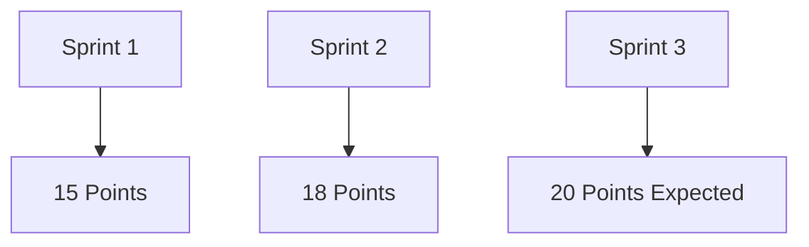
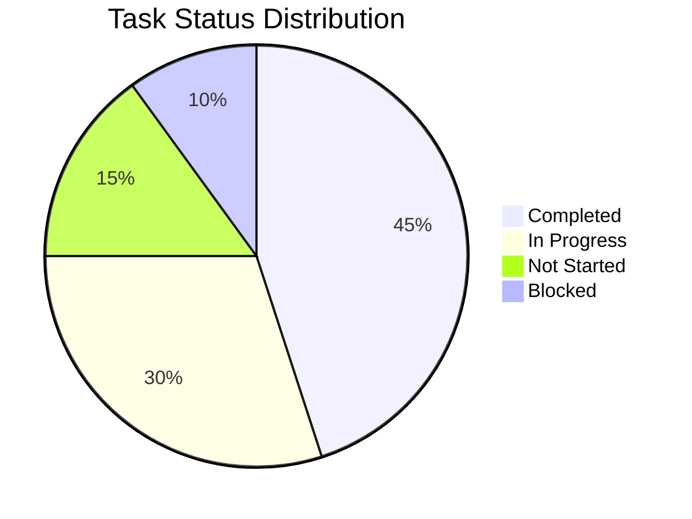
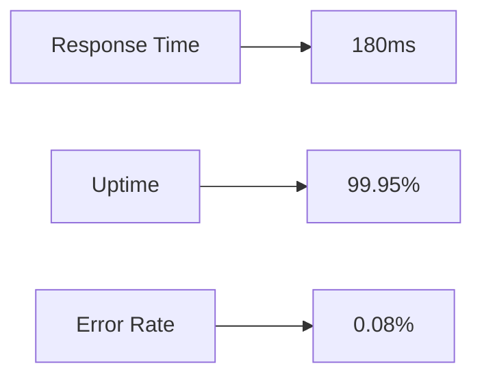

# 📋 PI Platform Development Task Log

## 🎯 Project Overview
The PI Platform is a comprehensive payment integration system that provides secure, scalable, and efficient payment processing capabilities. This task log tracks the development progress, tasks, and milestones of the project.

## 📊 Project Status
- **Start Date**: 2024-02-01
- **Current Phase**: Development
- **Overall Progress**: 45%

## 🔄 Current Sprint

### Sprint 3 (Feb 15 - Feb 29)
**Theme**: Core API Development & Documentation

#### Active Tasks
1. 🟡 API Documentation
   - Owner: Documentation Team
   - Status: In Progress
   - Due: Feb 20
   - Progress: 60%
   - Notes: Completing endpoint documentation and examples

2. 🟡 Payment Processing Implementation
   - Owner: Backend Team
   - Status: In Progress
   - Due: Feb 25
   - Progress: 75%
   - Notes: Implementing transaction rollback mechanism

3. 🔵 Authentication Service Testing
   - Owner: QA Team
   - Status: Testing
   - Due: Feb 22
   - Progress: 90%
   - Notes: Final security testing in progress

#### Completed Tasks
1. ✅ Database Schema Design
   - Completed: Feb 14
   - Owner: Database Team
   - Notes: Implemented with full indexing and optimization

2. ✅ API Gateway Setup
   - Completed: Feb 13
   - Owner: DevOps Team
   - Notes: Configured with rate limiting and monitoring

## 📝 Backlog

### High Priority
1. 🔴 Security Implementation
   - OAuth 2.0 Integration
   - API Key Management
   - Rate Limiting
   - Due: Mar 5

2. 🔴 Performance Optimization
   - Query Optimization
   - Caching Strategy
   - Load Testing
   - Due: Mar 10

### Medium Priority
1. 🔴 Monitoring Setup
   - Prometheus Configuration
   - Grafana Dashboards
   - Alert Rules
   - Due: Mar 15

2. 🔴 Developer Portal
   - API Console
   - Documentation Interface
   - Sample Code
   - Due: Mar 20

### Low Priority
1. 🔴 Additional Features
   - Batch Processing
   - Reporting Tools
   - Analytics Dashboard
   - Due: Apr 1

## 📈 Progress Tracking

### Sprint Velocity

### Task Completion Rate

## 🚀 Milestones

### Phase 1: Foundation
- ✅ Project Setup (Feb 1)
- ✅ Architecture Design (Feb 5)
- ✅ Database Schema (Feb 14)
- 🟡 Core API (Feb 29)

### Phase 2: Implementation
- 🔴 Security Features (Mar 15)
- 🔴 Integration Testing (Mar 30)
- 🔴 Performance Optimization (Apr 15)
- 🔴 Documentation (Apr 30)

### Phase 3: Launch
- 🔴 Beta Testing (May 15)
- 🔴 Security Audit (May 30)
- 🔴 Production Deploy (Jun 15)
- 🔴 Public Launch (Jul 1)

## 📊 Risk Register

### Current Risks
1. ⚠️ **High**: Security Implementation Timeline
   - Impact: Could delay launch
   - Mitigation: Additional resources allocated

2. ⚠️ **Medium**: Performance at Scale
   - Impact: User experience
   - Mitigation: Early load testing

3. ⚠️ **Low**: Documentation Completeness
   - Impact: Developer adoption
   - Mitigation: Documentation review process

## 📝 Development Notes

### Technical Decisions
1. Framework Selection
   - Chosen: Node.js with Express
   - Reason: Performance and ecosystem
   - Date: Feb 1

2. Database Choice
   - Chosen: PostgreSQL
   - Reason: ACID compliance and features
   - Date: Feb 3

### Architecture Updates
1. Added Redis Caching Layer
   - Date: Feb 10
   - Impact: Improved response times
   - Status: Implemented

2. Updated API Gateway
   - Date: Feb 13
   - Impact: Better security controls
   - Status: Testing

## 🔄 Daily Updates

### February 15, 2024
1. 🟢 Completed
   - Database indexing
   - API rate limiting
   - Basic authentication

2. 🟡 In Progress
   - Payment processing
   - Documentation
   - Integration tests

3. 🔴 Blocked
   - Performance testing (waiting for data)
   - Security audit (scheduled)

### February 14, 2024
1. 🟢 Completed
   - Database schema
   - Basic API endpoints
   - Development environment

2. 🟡 In Progress
   - Authentication service
   - API documentation
   - Test cases

## 📈 Metrics

### Performance Goals
- API Response: < 200ms
- Uptime: 99.9%
- Error Rate: < 0.1%

### Current Metrics

## 🎯 Next Steps

### Immediate Actions
1. Complete API documentation
2. Finish payment processing
3. Deploy monitoring system

### Week Goals
1. Complete Sprint 3 tasks
2. Start security implementation
3. Begin performance testing

### Month Goals
1. Complete core features
2. Pass security audit
3. Start beta testing 